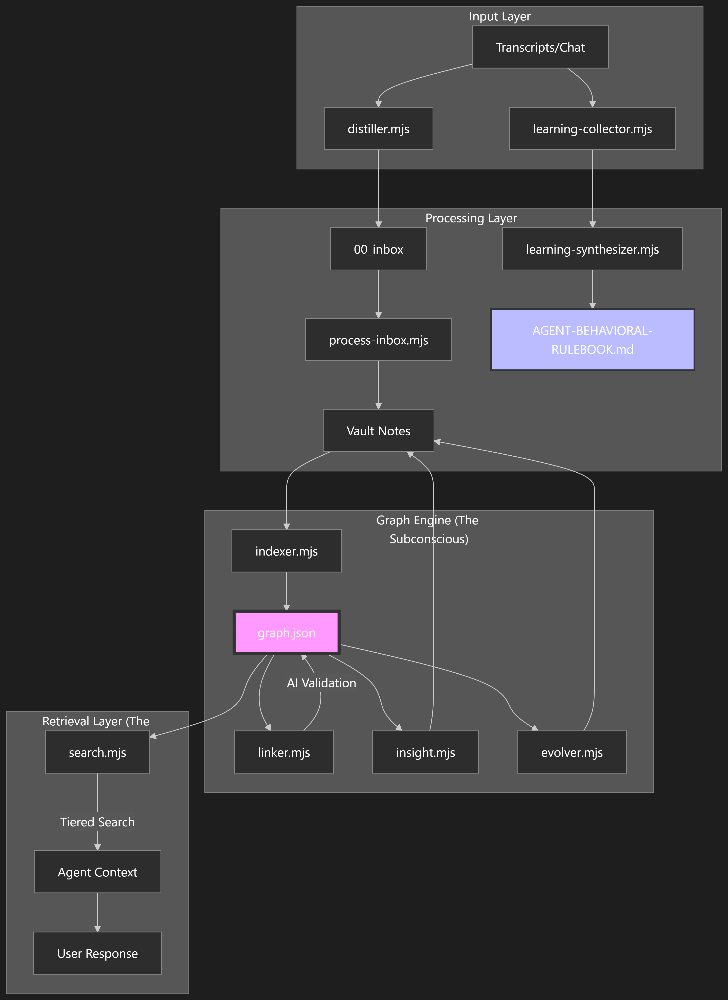
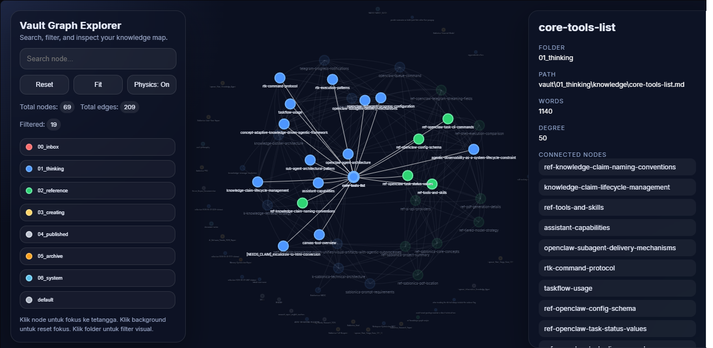

# 🧠 OpenClaw Knowledge Vault System Template

[](https://github.com/)
[](https://github.com/)
[](https://github.com/)

This workspace template designed for Openclaw agents and humans to collaborate in a self-evolving cognitive environment. Unlike traditional note-taking systems, this is a **Cognitive Operating System** that transforms raw data into structured, durable intelligence.

---

## ⚡ The Harness Thesis
This vault system is built upon the **Harness Thesis**, which posits that an AI agent's intelligence is maximized not only depend on model weights alone, but by providing a rigorous **operational harness**. 

The harness transforms a probabilistic LLM into a deterministic knowledge system by prioritizing:
- **Memory Discipline**: Shifting from "guessing" to "retrieving" via a structured vault.
- **Cognitive Architecture**: Using a Zettelkasten-inspired graph to maintain conceptual continuity.
- **Operational Protocols**: Enforcing strict behavioral rules (like Context Triangulation) to ensure grounded responses.

In short, the vault is the physical implementation of this thesis, ensuring the agent's performance is scalable, auditable, and profoundly more reliable.

---

## 🏗️ Core Architecture: The Agentic Triad

This system operates on a symbiotic relationship between three core components:

### 1. The Agent (The Curator)
The AI agent acts as the active curator. It doesn't just retrieve information; it distills, links, and synthesizes it. The agent follows a strict **Orientation Protocol** to ensure every response is grounded in the vault's current state.

### 2. The Vault (The Long-Term Memory)
A structured Zettelkasten-inspired repository. It separates "Thinking" from "Doing," ensuring that raw captures are processed into atomic claims before becoming part of the permanent knowledge base.

### 3. The Scripts (The Metabolism)
A suite of automated Node.js tools that prevent "data decay." These scripts handle the heavy lifting: semantic linking, graph indexing, and the generation of visual topology maps.

---

## 🔄 The Cognitive Lifecycle

Information in this workspace flows through three specialized loops to ensure continuous growth:

### 🟦 The Knowledge Loop (Data $\rightarrow$ Wisdom)
**Path:** `Raw Input` $\rightarrow$ `00_inbox` $\rightarrow$ `01_thinking/knowledge` (Atomic Facts) $\rightarrow$ `01_thinking/moc` (Connections) $\rightarrow$ `01_thinking/insights & concepts` (Higher-order Synthesis) $\rightarrow$ `03_creating` (Drafts) $\rightarrow$ `04_published` (Final Work).

### 🟩 The Learning Loop (Error $\rightarrow$ Evolution)
**Path:** `User Correction / Error` $\rightarrow$ `Learning Collector` $\rightarrow$ `Behavioral Rules` $\rightarrow$ `Improved Agent Behavior`.

### 🟪 The Reflection Loop (Analysis $\rightarrow$ Systemic Growth)
**Path:** `Session Review` $\rightarrow$ `Reflection Engine` $\rightarrow$ `Systemic Insights` $\rightarrow$ `Updated Rulebook`.


---

## 🗺️ Vault Structure & Roles

### 📌 The Core Index (`MEMORY.md`)
Before diving into the folders, the system utilizes a **Pointer-Based Memory System**. 
- **`MEMORY.md`** is NOT a storage for detailed knowledge. Instead, it acts as a **High-Level Map (Core Index)**.
- It contains **Pointers** (links/paths) to where specific information lives within the vault.
- **Pointer Categories**: To maintain a lean index, it only tracks key pointers with a maximum of **10 entries each** for:
    - **Active Projects/MOC's**: Current high-priority focuses.
    - **Current Drafts (`Creating`)**: Active works-in-progress.
    - **Recent Published**: Finalized deliverables.
- **Automatic Synchronization**: This file is automatically updated and maintained by the `update-memory.mjs` script, ensuring that pointers are always accurate and reflecting the current state of the vault.
- This prevents the main memory file from becoming bloated and ensures the agent always navigates to the most up-to-date atomic note.

### 🟦 Cognitive Vault (The Brain)
The cognitive vault is designed for knowledge synthesis and long-term memory.

| Folder | Role | Description |
| :--- | :--- | :--- |
| `00_inbox/` | **The Waiting Room** | Transit zone for raw captures and AI-distilled claims. |
| `01_thinking/` | **The Brain** | The active cognitive space. Contains Knowledge, MOCs, Insights, and Concepts. |
| `02_reference/` | **The Library** | Static, high-trust technical facts and external documentation. |
| `03_creating/` | **The Workshop** | Production zone for drafts, reports, and generated assets. |
| `04_published/` | **The Gallery** | Final, approved deliverables ready for external use. |
| `05_archive/` | **The Attic** | Obsolete versions and deprecated ideas. |
| `06_system/` | **The Engine Room** | Core philosophy, maintenance guides, and the visual graph. |

### ⚙️ System Infrastructure (Operational)
The operational folders handle the "metabolism" and the mechanics of the agent's execution.

| Folder | Role | Description |
| :--- | :--- | :--- |
| `scripts/` | **The Metabolism** | Automation, graph indexing, and semantic linking tools. |
| `workers/` | **The Specialist Guild** | Definitions and SKILL.md files for specialized sub-agents. |
| `logs/` | **The Black Box** | Execution logs for debugging and audit trails. |
| `.system/` | **The Nervous System** | Internal state, index files (e.g., `graph.json`), and configs. |

---

## 🛠️ System Requirements

To function correctly, this workspace requires:
- **Embedding Provider (Mandatory)**: An embedding engine (e.g., Ollama, OpenAI, or Cohere) is required for semantic search and automatic linking.
- **AI Completion Provider**: A primary and fallback LLM that is **OpenAI-compatible** (supporting the `/v1/chat/completions` endpoint).
- **Runtime**: Node.js installed on the host system.

##  Getting Started

### 1. Installation
- Simply copy this template folder into your **OpenClaw Workspace**.
- Install the required dependencies (`glob` library used for file indexing):
  ```bash
  npm install
  ```

### 2. Environment Configuration
- Copy the example environment file to create your own:
  ```bash
  cp .env.example .env
  ```
- Open `.env` and fill in the following required parameters:

| Category | Variable | Description |
| :--- | :--- | :--- |
| **General** | `AI_REQUEST_DELAY` | Delay between AI requests (ms) to prevent rate-limiting. |
| **Embeddings** | `EMBEDDING_URL` | URL of the embedding engine (e.g., Ollama or OpenAI). |
| | `EMBEDDING_MODEL` | The specific embedding model used for semantic search. |
| | `EMBEDDING_KEY` | API key for the embedding provider. |
| **Primary AI** | `PRIMARY_AI_URL` | Endpoint for the main curator agent. |
| | `PRIMARY_AI_MODEL` | The primary LLM model identifier. |
| | `PRIMARY_AI_KEY` | API key for the primary AI provider. |
| **Fallback AI** | `FALLBACK_AI_URL` | Endpoint for the backup agent. |
| | `FALLBACK_AI_MODEL` | The backup LLM model identifier. |
| | `FALLBACK_AI_KEY` | API key for the fallback AI provider. |
| **Graph Tuning** | `SIMILARITY_THRESHOLD` | Confidence score (0-1) for automatic semantic linking. |
| | `MAX_CANDIDATES_PER_FILE` | Max number of related nodes per file. |
| | `PRE_FILTER_MIN_SHARED` | Minimum shared links required for a node to be considered a candidate. |
| | `EMBEDDING_BATCH_SIZE` | Number of embeddings processed per batch. |
| | `MAX_RETRIES` | Maximum number of retry attempts for failed AI requests. |
| **Graph Search** | `SEMANTIC_THRESHOLD` | Minimum score for a result to be included in semantic search. |
| | `TOP_K` | Number of top-most relevant results to retrieve. |
| | `MAX_NODES` | Maximum total nodes to return in search results. |
| | `HUB_DEGREE_LIMIT` | Limit for treating a node as a "hub" in graph traversal. |

### 3. Triggering the Metabolism
To initialize the system and generate the core files (such as `graph.json` in the `.system` folder), you must trigger the agent's hooks:
- Start a new session `command:new` or `command:reset`.
- This triggers the **Vault Memory Sync** hook, which automatically runs the Distiller, Indexer, and other core scripts to build your initial state.

### 4. First-Time Deep Sync
For the first run, it is highly recommended to perform a full system indexing and a deep verification of all semantic links to ensure a perfect initial graph:

1. **Deep Semantic Linking**: Establish all cross-note connections.
   ```bash
   node vault/scripts/graph/linker.mjs --deep-verify
   ```
   *This creates the semantic cache at `.system/cache/embeddings_cache.json` to speed up future lookups.*

2. **Full Graph Indexing**: Generate the core knowledge map.
   ```bash
   node vault/scripts/graph/indexer.mjs --full
   ```
   *This generates the master index at `.system/graph/graph.json`.*

**Note:** Subsequent runs are handled automatically by the system hooks without requiring the `--deep-verify` or `--full` flags, ensuring efficient real-time updates.

### 5. Ongoing Maintenance
Once initialized, the system is powered by the **OpenClaw Cron Jobs**. These scheduled tasks automatically handle deep semantic linking, insight synthesis, and graph indexing to prevent data decay.

Refer to the [System Metabolism](#-system-metabolism-automation) section below for the full recommended schedule and script paths.

### 6. Visualizing the Network
To generate and view a human-readable map of your agent knowledge topology:
```bash
node vault/scripts/maintenance/generate-graph-html.mjs
```
Then, open `vault/06_system/graph_view.html` in your browser.


*Example of the Vault Graph Explorer: A semantic map of connected knowledge nodes, filtered by folder and searchable by topic.*

---

## 🔍 Accessing Knowledge

The true power of this vault is in **Semantic Graph**. Instead of searching for exact keywords, you can query concepts and discover hidden connections across your entire knowledge base.

### Using the Graph Search Tool
To retrieve information based on meaning and relationship, use the `graph-search` script:
```bash
node vault/scripts/graph/graph-search.mjs "knowledge graph"
```

**Example Output:**
The tool returns a structured JSON response categorizing results into **Tiers** (Primary, Supporting, and Related) to guide the agent's reasoning process.

```json
{
  "status": "success",
  "query": "knowledge graph",
  "tiers": {
    "primary": {
      "description": "Most relevant — read these first",
      "nodes": [
        {
          "node": "k-pipeline-architecture",
          "path": "vault/01_thinking/knowledge/k-pipeline-architecture.md",
          "preview": "End-to-End Knowledge Pipeline Architecture... Distiller → Linker → Learning/Reflection forms a clean flow.",
          "noteType": "atomic"
        },
        {
          "node": "k-linker-features",
          "path": "vault/01_thinking/knowledge/k-linker-features.md",
          "preview": "Linker Script Semantic Connection Optimization... connects knowledge notes using dual-hash caching.",
          "noteType": "atomic"
        }
      ]
    },
    "supporting": {
      "description": "Related context — read if primary insufficient",
      "nodes": [
        {
          "node": "k-distiller-features",
          "path": "vault/01_thinking/knowledge/k-distiller-features.md",
          "preview": "Distiller Script Knowledge Extraction Features..."
        }
      ]
    },
    "related": { "nodes": [] }
  },
  "meta": { "ms": 10, "total": 10 }
}
```

**How it works:**
The tool analyzes the `graph.json` index to identify the most relevant nodes and their semantic connections. This allows you to traverse the knowledge network, discovering related insights that a standard file search would miss.

---

## 🛠️ Script Reference

The vault's functionality is powered by a suite of Node.js scripts. Each is designed for a specific stage of the cognitive lifecycle.

### 🌐 Graph Engine (`/scripts/graph/`)
*Focuses on semantic discovery and structure.*
- **`distiller.mjs`**: Extracts atomic knowledge from session transcripts into three specialized claim name based types: `k-` (atomic knowledge claim), `ref-` (reference), and `ctx-` (context claim), while ensuring uniqueness.
- **`indexer.mjs`**: Builds and updates the master index (`graph.json`) of all vault nodes.
- **`linker.mjs`**: Computes embeddings and establishes semantic relations between notes.
- **`insight.mjs`**: Traverses the graph to discover emergent, higher-order insights.
- **`evolver.mjs`**: Proposes updates to the knowledge ontology and conceptual hierarchies.
- **`graph-search.mjs`**: The primary tool for semantic query and knowledge retrieval.

### 🧠 Learning Engine (`/scripts/learning/`)
*Focuses on behavioral evolution and self-improvement.*
- **`learning-collector.mjs`**: Captures errors and user corrections from active sessions.
- **`learning-synthesizer.mjs`**: Merges new learning into the `AGENT-BEHAVIORAL-RULEBOOK.md`.
- **`reflection.mjs`**: Analyzes session transcripts to extract systemic insights.
- **`reflection-synthesizer.mjs`**: Consolidates reflections into permanent behavioral rules and update `AGENT-BEHAVIORAL-RULEBOOK.md`.

### 🧹 Maintenance Engine (`/scripts/maintenance/`)
*Focuses on system health and data integrity.*
- **`update-memory.mjs`**: Synchronizes `MEMORY.md` pointers with the current vault state.
- **`process-inbox.mjs`**: Triages and prepares raw input in `00_inbox` for distillation.
- **`conflict-resolver.mjs`**: Identifies and resolves contradictory claims in the knowledge base.
- **`generate-graph-html.mjs`**: Renders the knowledge topology into a visual HTML map.

### ⚙️ Core Utilities (`/scripts/core/`)
- **`ai-client.mjs`**: Standardized wrapper for all AI provider communications.
- **`logger.mjs`**: Centralized logging system for auditing script executions.

---

## ⚙️ System Metabolism (Automation)

The vault's "metabolism" is powered by the **OpenClaw Agent Infrastructure**, using a combination of reactive and scheduled triggers:

### ⚡ Trigger Mechanisms
- **Event-Driven (Hooks)**: Reactive scripts (located in `hooks/`) that trigger immediately upon specific hooks events (`command:new` or `command:reset`) to ensure real-time memory synchronization.

  **Important:** Ensure you **ADD** and **ENABLE** these custom hooks (`vault-memory-sync`) within your `OpenClaw.json` configuration to activate this functionality.

- **Time-Driven (Cron Jobs)**: Scheduled tasks (located in `vault/scripts/`) that run periodically to prevent data decay and perform deep semantic linking.

### 📅 Recommended Cron Job Schedule
To keep the vault healthy, configure the following scripts in your OpenClaw scheduler:

| Job Name | Script | Schedule | Purpose |
| :--- | :--- | :--- | :--- |
| **Deep Semantic Linking** | `node vault/scripts/graph/linker.mjs --deep-verify` | Daily | Re-validate all semantic relations |
| **Insight Synthesis** | `node vault/scripts/graph/insight.mjs` | Daily/Weekly | Discover higher-order insights |
| **Ontology Evolution** | `node vault/scripts/graph/evolver.mjs` | Weekly | Propose new conceptual hierarchies |
| **Full Graph Index** | `node vault/scripts/graph/indexer.mjs --full` | Weekly | Full rebuild of `graph.json` |
| **Conflict Resolution** | `node vault/scripts/maintenance/conflict-resolver.mjs` | Weekly | Resolve contradictory claims |

### 🛠️ Core Engines
The logic for these triggers resides in `vault/scripts/`:
- **Graph Engine (`/graph/`)**: Handles semantic linking, indexing, and the discovery of emergent insights.
- **Learning Engine (`/learning/`)**: Processes behavioral deltas to evolve the agent's operating rules.
- **Maintenance Engine (`/maintenance/`)**: Manages `MEMORY.md` synchronization and inbox triage.

---

## 📜 Core Philosophy
> *"The Network is the Knowledge."*

In this system, the value is not found in any single note, but in the **links between them**. By prioritizing the connection over the content, the vault becomes a living organism that grows more intelligent with every interaction.

**Key Operating Principle:** Always perform **Context Triangulation** (Rules $\rightarrow$ Memory $\rightarrow$ MOC) before acting.

## 🤖 Agent Operating Principles Example

The agent operates under a strict set of mandates derived from the `AGENTS.md` system file. These rules transform the AI from a simple chatbot into a disciplined curator of the knowledge vault.

```markdown
# AGENTS: Operating Rules

## Orientation Protocol (Context Triangulation)
**MANDATORY** at the start of every session before responding to the user:
1. **Rules Load:** Read `vault/01_thinking/AGENT-BEHAVIORAL-RULEBOOK.md` (self-improvement results).
2. **Location Scan:** Check `MEMORY.md` for active projects (MOC) and key pointers.
3. **Strategy Scan:** Read relevant **MOCs** (Map of Contents) for the big picture.
4. **Confirmation:** After completing steps 1-3, confirm with: reply the user message.

## Tool Protocol
- **[MANDATORY]** All `exec` calls MUST use the `rtk` proxy to minimize tokens: `rtk <cmd>` for any shell command.
- **Tools:** Read `TOOLS.md` for available tools

## Memory & Vault Orientation
1. Use `graph-search` before claiming information is unavailable when the task may relate to previous work, projects (MOCs), notes, or stored knowledge.
2. Use `memory_search` only to verify text/strings.
3. Follow `[[wiki-links]]` and check typed semantic relations (e.g. `supports`, `contradicts`).
4. After project work: update MOC and execute `node vault/scripts/graph/indexer.mjs` to synchronize `graph.json`.
5. Generated files (e.g .py, .docx, .pdf, etc.) should inside `vault/03_creating/assets/`

## Decision Tree & Delegation
- **Casual / Quick Fact:** Answer directly and efficiently.
- **Past Work / Knowledge:** **Graph Discovery FIRST** via `node /vault/scripts/graph/graph-search.mjs <query>`.
- **Sub Agents:** Use `sessions_spawn` **only for tasks explicitly listed in the *Sub-Agent Workers* table**—no ad-hoc spawns without user approval (**Context Garbage Collection**).
- **`sessions_yield`:** Avoid sessions_yield. Acknowledge task and end turn immediately, prioritize sub agent background execution to maintain uninterrupted conversation flow.
- **Project Creation:** Use format template MOC `vault/06_system/template-MOC.md` and create a Map of Content (MOC) file inside `vault/01_thinking/moc`.

## Sub-Agent Workers
**[MANDATORY]** Always use worker `SKILL.md`.
| Worker | When To Use | Model | Skill File |
|--------|---------|-------|------------------|
| document-writer | Reports, documentation, SOPs, proposals, summaries, polished deliverables | `google/gemma-4-31b-it` | `vault/workers/document-writer/SKILL.md` |
| data-analyst | Calculations, spreadsheet analysis, validation, trends, metrics, forecasting inputs | `mistral/mistral-medium-2508` | `vault/workers/data-analyst/SKILL.md` |

## Verification (PreCompletion)
Before finishing, compare output against the user's original intent. For code, run tests and use **loop detection** (stop if 3+ edits fail).
```
---

**Optional Tools** - [RTK CLI Proxy](https://github.com/rtk-ai/rtk)
To optimize token consumption and enhance the efficiency of AI agent command shell interactions.

---
## ⚙️ OpenClaw.json Configuration Example

To ensure the agent operates with maximum efficiency, the following `openclaw.json` configuration is recommended.

```json
{
  "agents": {
    "defaults": {
      "toolProgressDetail": "explain",
      "thinkingDefault": "high",
      "maxConcurrent": 4,
      "subagents": {
        "model": "YOUR DEFAULT SUB AGENT MODEL",
        "delegationMode": "prefer",
        "maxConcurrent": 4,
        "thinking": "medium",
        "allowAgents": ["*"],
      },
      "contextPruning": {
        "mode": "cache-ttl",
        "ttl": "5m",
        "keepLastAssistants": 5
      },
      "memorySearch": {
        "enabled": true,
        "provider": "ollama",
        "model": "nomic-embed-text:v1.5",
        "sources": ["memory", "sessions"],
        "query": {
          "hybrid": { "enabled": true, "vectorWeight": 0.7, "textWeight": 0.3 }
        }
      }
    },
    "list": [
      {
        "id": "main",
        "subagents": {
          "allowAgents": ["*"]
        },
      }
    ]
  },
  "tools": {
    "profile": "coding",
    "alsoAllow": ["sessions_spawn", "sessions_yield", "subagents"]
  },
  "hooks": {
    "internal": {
      "enabled": true,
      "entries": {
        "session-memory": { "enabled": true },
        "vault-memory-sync": { "enabled": true }
      }
    }
  }
}
```
