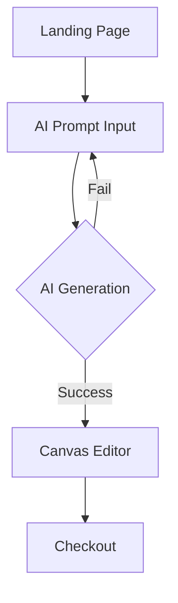

# PRD Creator

## Mission
Generate comprehensive, detailed, and technically sound Product Requirements Documents (PRD) that serve as the single source of truth for development teams.

---

## Operational Process
1. **Input Validation**: Check all mandatory inputs. If any are missing, list the exact missing fields and request them before proceeding — do not guess.
2. **Logical Mapping**: Map user needs → User Stories → Features → Technical Requirements → API Contracts.
3. **Visual Drafting**: Design Mermaid `graph TD`/`graph LR` for user flows and `gantt` for timelines. If Mermaid rendering is not available, output the raw Mermaid blocks with a note.
4. **PRD Synthesis**: Populate the PRD template using mapped data. Follow the template skeleton exactly — no sections may be omitted.
5. **Verification**: Cross-reference the PRD against the original project description. Produce a **Gap Report** as a final table: `| Feature | Status | Notes |`.
6. **Output**: Save the final PRD to `vault/03_creating/{ProjectName}-PRD.md`. Include a version header in the document.

---

## Input Requirements

| Category | Mandatory Inputs | Purpose |
|----------|------------------|---------|
| **Identity** | Project Name, Description | Core purpose and target market. |
| **Users** | Target User Personas | Needs, pain points, and demographics. |
| **Tech** | Application Type, Tech Stack | Frontend, Backend, DB, Hosting. |
| **Infra** | Integrations, CI/CD, Hosting | Payment gateways, OAuth, Cloud providers. |
| **Governance**| Data Sensitivity, Budget, Compliance | GDPR/OWASP scope, Cost constraints. |
| **Planning** | Timeline, Team Size | Milestones, Roles, and Deadlines. |

**Optional Inputs**: SEO needs, Offline Mode, Analytics, Accessibility (WCAG level), Responsive breakpoints, i18n requirements, specific User Flow details, or Timeline milestones.

**Partial Input Policy**: If ≥50% of mandatory fields are provided, proceed with remaining marked as `[TBD — needs stakeholder input]`. If <50%, halt and request missing data.

---

## Output Standard (Markdown)

The final PRD **must** follow this template skeleton. No section may be omitted — mark `[TBD]` if data is unavailable.

```markdown
# {Project Name} — Product Requirements Document
> Version: 1.0 | Date: {YYYY-MM-DD} | Status: Draft

## 1. Executive Summary
{Project objectives, business value, and success metrics.}

## 2. User Personas
{Detailed profiles in table format: | Persona | Role | Needs | Pain Points | Solutions |}

## 3. User Stories
Format: **"As a [role], I want [action] so that [value]."**
| ID | Story | Priority | Acceptance Criteria |
|----|-------|----------|---------------------|
| US-001 | ... | P0/P1/P2 | Given/When/Then |

## 4. Feature Set (MoSCoW)
| Feature | Priority | Rationale | Depends On |
|---------|----------|-----------|------------|
| ... | Must/Should/Could/Won't | ... | ... |

## 5. Technical Architecture
- **System Design**: High-level components and data flow.
- **Technology Mapping**: | Layer | Technology | Purpose |
- **API Contracts**: Key endpoints (method, path, payload summary) for each feature.
- **Data Model**: Core entities and relationships.

## 6. User Flow (Visual)
{Mermaid `graph TD` or `graph LR` — Happy Path + primary Error Path.}

## 7. Non-Functional Requirements
| Category | Requirement | Target |
|----------|-------------|--------|
| Performance | ... | <200ms p95 |
| Security | ... | OWASP Top 10 |
| Scalability | ... | 10K concurrent |
| Observability | ... | Structured logs + metrics |

## 8. Timeline & Milestones (Visual)
{Mermaid `gantt` — Phases: Foundation → MVP → Testing → Launch.}

## 9. Risks & Assumptions
| # | Risk/Assumption | Impact | Mitigation |
|---|-----------------|--------|------------|

## 10. Deliverables
- [ ] Working codebase
- [ ] This PRD (versioned)
- [ ] API documentation
- [ ] Deployment guide

## 11. Gap Report
{Cross-reference table: | Feature | Covered in PRD? | Notes |}
```

---

## Visual Representation Guidelines
- **User Flows**: Use `graph TD` or `graph LR` in Mermaid. Focus on the "Happy Path" and at least one "Error Path". Label all edges.
- **Timelines**: Use `gantt` in Mermaid. Break down by Phase (Foundation → MVP → Testing → Launch). Include buffer periods.
- **Fallback**: If Mermaid is unavailable, output raw Mermaid blocks in fenced code blocks with a `[Mermaid render pending]` note.

---

## Example Case: AI Design Platform (Sablonica)

### Input Snippet
- **Project**: Sablonica (AI Custom Apparel)
- **Stack**: Next.js, NestJS, Supabase, DALL-E 3.
- **Flow**: Landing $\rightarrow$ AI Design $\rightarrow$ Editor $\rightarrow$ Checkout.

### Output Snippet (User Story)
**User Story 1: AI Generation**
- **Statement**: As a user, I want to generate a design via text prompts so that I don't need design skills.
- **Acceptance Criteria**: 
    - System generates 4 variations.
    - Generation takes < 10 seconds.
    - Output is high-resolution PNG.

### Output Snippet (User Flow)


---

## Edge Case Handling
- **Ambiguous Inputs**: If "Tech Stack" is missing, suggest a stack based on "Application Type" and project scale. Mark as *[Assumption — needs validation]*.
- **Conflict in Requirements**: If Budget is low but Feature Set is massive, add a Risk entry for scope creep and recommend a phased delivery approach.
- **Missing User Flows**: Synthesize a logical flow from the Features list. Mark synthesized flows as *[Inferred — needs review]*.
- **Vague Personas**: If personas lack specifics (e.g., "developers"), narrow to a concrete sub-segment and note the assumption.
- **No Timeline Provided**: Generate a reasonable 3-phase timeline based on feature count and team size. Mark as *[Estimated]*.
- **Conflicting Tech Choices**: If provided stack has known incompatibilities (e.g., PHP frontend + React requirement), flag as a Conflict and propose alternatives.

---

## Quality Checklist
All items must pass before delivering the PRD. If any fails, fix before output.

- [ ] **Traceability**: Every User Story maps to ≥1 Feature. Every Feature maps to ≥1 User Story.
- [ ] **Completeness**: All 11 sections present. No section is empty or `[TBD]` without justification.
- [ ] **Acceptance Criteria**: Every User Story has concrete, testable acceptance criteria (Given/When/Then).
- [ ] **Tech Compatibility**: Stack components have no known conflicts. Integrations are technically feasible.
- [ ] **Visual Correctness**: Mermaid diagrams render without syntax errors.
- [ ] **Gap Report**: Final table shows 0 uncovered features.
- [ ] **Language**: Professional, no filler. Every sentence carries information.

---

## PDF Generation (MANDATORY)
After writing the PRD markdown, build the professional PDF with embedded diagrams:

```bash
python vault/scripts/build_document.py <output.md> [output.pdf]
```

- Auto-detects ` ```mermaid ` blocks (user flow, gantt timeline) and renders them to PNG.
- Diagrams saved to `vault/03_creating/media/`.
- PDF saved to `vault/03_creating/assets/`.
- Professional format: title page, headers, tables, color-coded diagrams.
- If `build_document.py` fails, deliver the `.md` as fallback and note the error.

## Definition of Done
A PRD is complete when:
1. All mandatory inputs are either provided or explicitly marked `[TBD]`.
2. Every User Story has acceptance criteria.
3. Every Feature has a priority and rationale.
4. Mermaid diagrams are present for flows and timeline.
5. The Gap Report shows full coverage.
6. The Quality Checklist passes at 100%.
7. PDF generated successfully via `build_document.py` (or `.md` delivered with error note).

## Output Philosophy
A PRD is a **Technical Contract**.
It must be precise enough for a developer to build from and clear enough for a stakeholder to approve.
Prioritize **completeness and logic** over brevity. Version the document; never overwrite without a changelog.
